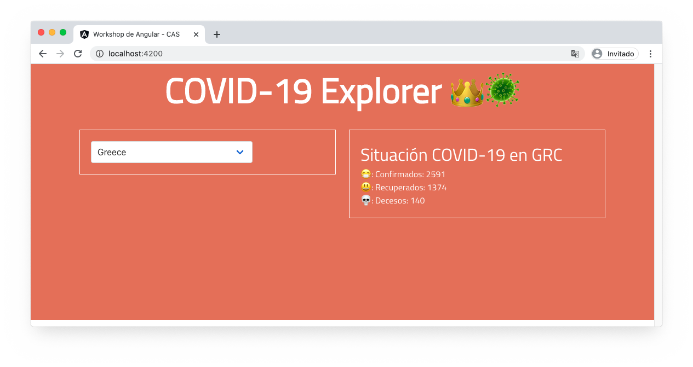

# Construyendo una aplicación web con Angular
> Workshop online para Clínica Alemana de Santiago



# Herramientas necesarias
* Node v12.16.1 (se recomienda usar [NVM](https://medium.com/devschile/m%C3%BAltiples-versiones-de-node-con-nvm-63b2ac715c38) para administración de versiones).
* Angular CLI v9.0.7

# Instalación
0. Instalar NodeJS
1. Instalar **Angular CLI**:
```bash
npm install -g @angular/cli@9.0.7
```
2. Clonar este repositorio.
3. Dirigirse al directorio de la aplicación clonada e instalar las dependencias:
```bash
npm install
```
4. Ejecutar `ng serve`.
